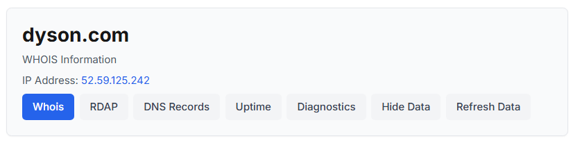
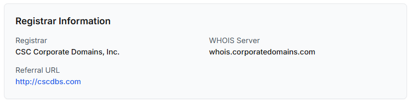
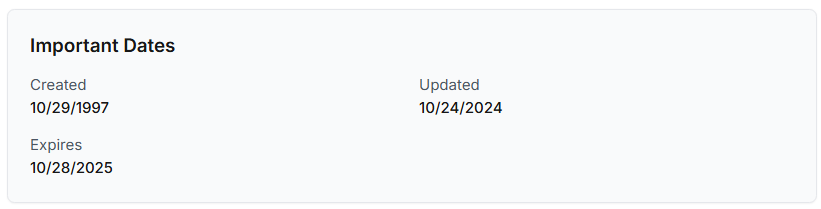
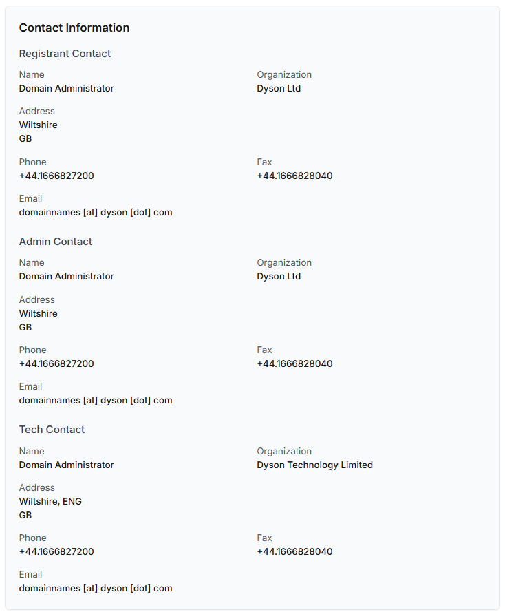
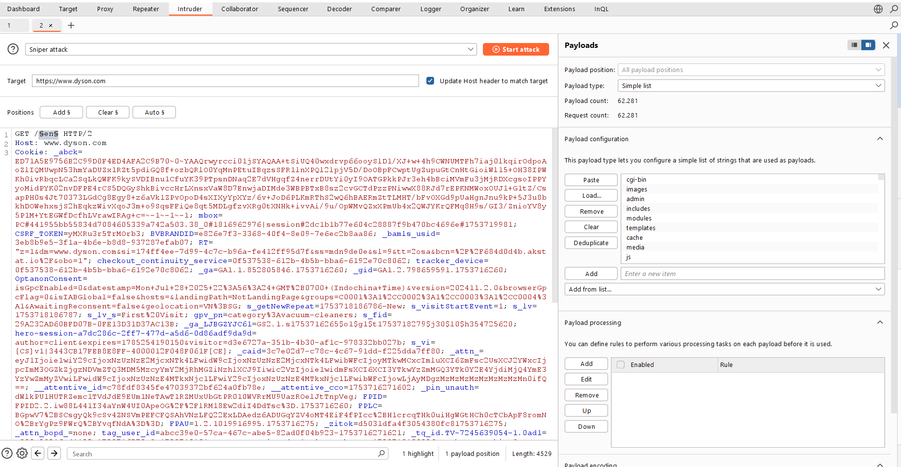
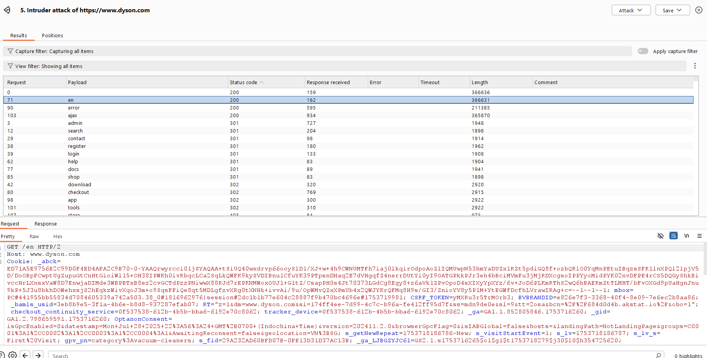
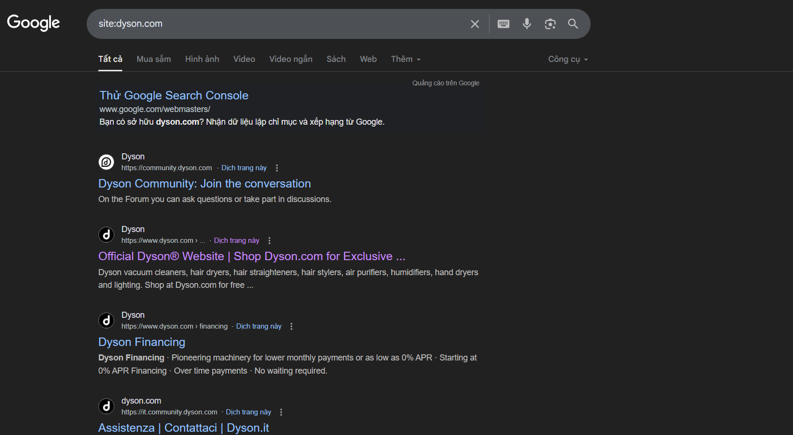
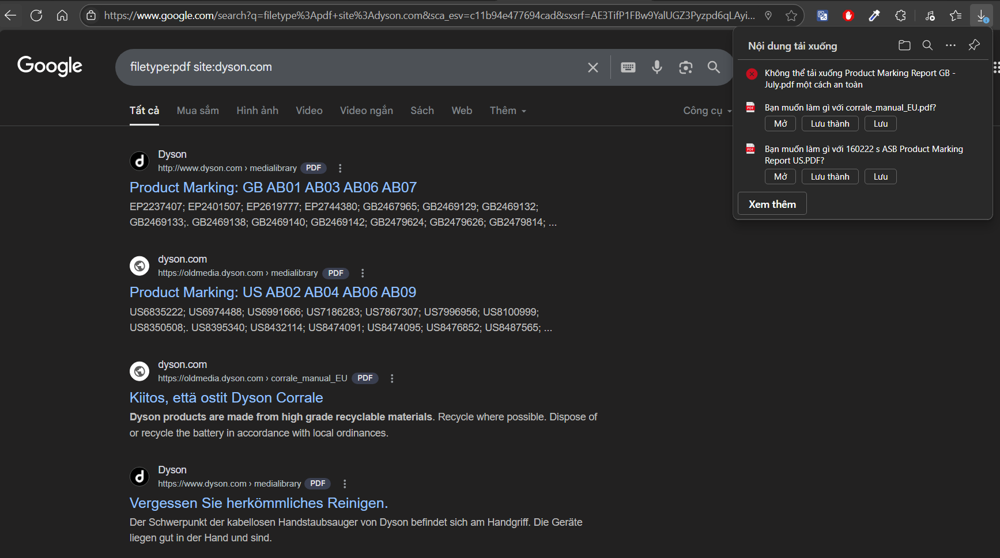
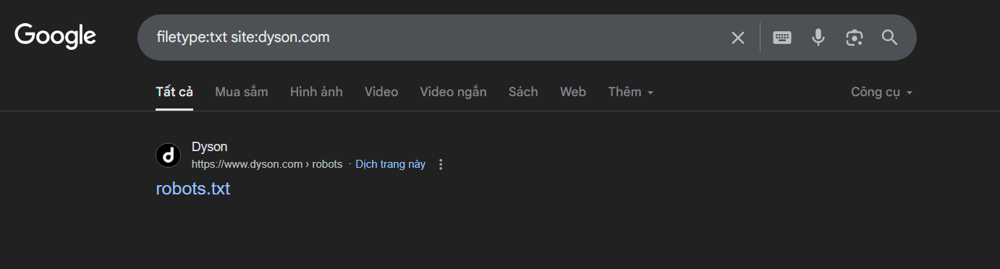

# Information Gathering
> Mục tiêu: dyson.com
> 
> Thực hiện: Trần Tiến Đức
> 
> Cập nhật lần cuối: 29/07/2025

# Mục lục
- [Information Gathering](#information-gathering)
- [Gathering Information Using Whois Lookup](#gathering-information-using-whois-lookup)
- [Discovering Websites On The Same Server](#discovering-websites-on-the-same-server)
- [Discovering Subdomains](#discovering-subdomains)
- [Discovering Sensitive Files](#discovering-sensitive-files)
- [Google Hacking](#google-hacking)


## Gathering Information Using Whois Lookup

Ở đây ta sẽ sử dụng công cụ **`whois`** ở **who.is**





Ta sẽ thu thập được những thông tin cơ bản sau:
|Mục                    |Thông tin
|-----------------------|---------------------------
|Địa chỉ IP             |52.59.125.242
|Nhà đăng ký            |CSC Corporate Domains, Inc
|WHOIS Server           |whois.corporatedomains.com
|Ngày đăng ký           |29/10/1997
|Ngày cập nhật          |10/24/2024
|Ngày hết hạn           |10/28/2025
|Điện thoại             |+44.1666827200
|Fax                    |+44.1666828040
|Email                  |domainnames [at] dyson [dot] com


Thông tin liên hệ:
|Vai trò        |Tên liên hệ            |Tổ chức        |Quốc gia
|---------------|-----------------------|---------------|-------------
|Registrant     |Domain Administrator   |Dyson Ltd      |Wiltshire, GB
|Admin          |Domain Administrator   |Dyson Ltd      |Wiltshire, GB
|Tech           |Domain Administrator   |Dyson Ltd      |Wiltshire, GB


## Discovering Websites On The Same Server
Để tim được những website khác có cùng server (địa chỉ IP) ta sử dụng `Reverse IP lookup`.
`Reverse IP lookup` là quá trình dùng địa chỉ IP để tìm ra các tên miền (domain) được host trên cùng địa chỉ IP đó.

Ở viewdns.info có hỗ trợ chức năng Reverse IP lookup [tại đây](https://viewdns.info/reverseip/). Đây là danh sách Websites On The Same Server
|Websites               |
|-----------------------|
bluesurftrust.com	
buydysonairblade.uk	
dyson.bg	
dyson.cn	
dyson.co.jp	
dyson.co.kr	
dyson.co.th	
dyson.com	
dyson.com.ar	
dyson.com.cy	
dyson.com.jm	
dyson.com.kh	
dyson.com.pa	
dyson.com.ru	
dyson.cr	
dyson.do	
dyson.gt	
dyson.is	
dyson.lu	
dyson.ro	
dyson.si	
dysonbrandcentre.com	
dysoninstitute.co.uk	
dysonmalmesbury.co.uk	
dysonoffice.com	
dysonoutlet.co.uk	
...

## Discovering Subdomains
Subdomain là tên miền phụ của một website dùng để tạo ra các khu vực hoặc dịch vụ riêng biệt trên cùng một trang web
Ví dụ: một trang web có domain như sau: `example.com` thì subdomain của nó là `subdomain.example.com`

Ở đây ta sẽ dùng **`subfinder`** được viết bằng `Go` đem lại hiệu suất nhanh.
```bash
$ subfinder -d dyson.com -v

pandemicflu.api.cppref.dyson.com
api.cptest.dyson.com
www.depannage-ordinateur-windows-virus.161.dyson.com
www.vaccinetemperature.1ci1.dyson.com
vaccines.b1.dyson.com
covidapi.dyson.com
covideo.cfappapi.cppe.dyson.com
console.cpppe.dyson.com
awseg-au.dyson.com
iladmin.content.dyson.com
690.dyson.com
access-uk-motor.dyson.com
covideo.b200.dyson.com
vaccinetemperature.commvault-test.dyson.com
ppe.connected.dyson.com
go.cpnst-prd.dyson.com
deletev9redirectvirus.1ci1.dyson.com
voroncovka.20.dyson.com
antivirus-uk.dyson.com
livelab.dyson.com
brokerbridge.cpsi.dyson.com
kefalos-uncovered.broker19.cptrials.dyson.com
identity-hub.dyson.com
sa-content.commerce.dyson.com
...
```

Lưu toàn bộ subdomain vào file `sub.txt`. Ta sẽ dùng **`httpx`** để lọc ra những subdomain có thể truy cập được sau đó lưu vào `sub2.txt`

```bash
$ cat sub.txt |  httpx -fc 404 -title -wc -sc -ct -cl -web-server -asn -location > sub2.txt
$ cat sub2.txt

https://admin-content.commerce.dyson.com [401] [] [340] [text/html] [Error] [] [AS54113, FASTLY, US, 151.101.0.0/22] [83]
https://ae-content.commerce.dyson.com [301] [/en-AE/] [0] [] [] [] [AS54113, FASTLY, US, 151.101.0.0/22] [1]
http://admin.template.staging.dyson.com [301] [https://admin.template.staging.dyson.com/] [0] [] [] [AkamaiGHost] [AS45899, PT-AS- PT Corp, VN, 113.171.234.0/24] [1]
http://abcc.dyson.com [200] [] [49503] [text/html] [Cost Calculator] [Microsoft-IIS/7.5] [AS45899, PT-AS- PT Corp, VN, 113.171.234.0/24] [2388]
https://appapi.cp.dyson.com [200] [] [3] [application/json] [] [cloudflare] [2]
https://authoring.b2bapp.dyson.com [200] [] [274] [text/html] [HealthCheck] [Microsoft-IIS/7.5] [AS20940, AKAMAI-ASN1, NL, US, 23.200.143.0/24] [7]
https://beta.dyson.com [403] [] [368] [text/html] [Access Denied] [AkamaiGHost] [AS45899, PT-AS- PT Corp, VN, 113.171.234.0/24] [13]
https://central-test.dyson.com [200] [] [2169] [text/html] [Dyson Central - Test Environment] [Microsoft-IIS/10.0] [AS702, UUNET, US, GB, 62.189.0.0/16] [110]
https://central.dyson.com [200] [] [2150] [text/html] [Dyson Central] [Microsoft-IIS/10.0] [AS702, UUNET, US, GB, 62.189.0.0/16] [107]
https://chat-dev.dyson.com [200] [] [7033] [text/html] [chatDyson] [uvicorn] [AS20940, AKAMAI-ASN1, NL, US, 104.84.150.0/24] [340]
https://chat.dyson.com [200] [] [7030] [text/html] [chatDyson] [uvicorn] [AS20940, AKAMAI-ASN1, NL, US, 104.84.150.0/24] [340]
https://community.dyson.com [200] [] [52679] [text/html] [Join the conversation | Dyson Community] [nginx] [1656]
https://gtm.dyson.com [200] [] [35] [image/gif] [] [] [AS15169, GOOGLE, US, 216.239.32.0/24] [1]
https://go.cpnst-prd.dyson.com [204] [] [0] [application/json] [] [] [AS16509, AMAZON-02, US, 13.226.120.0/21] [1]
...
```

## Discovering Sensitive Files
Ta có thể dùng **`gobuster`**, **`dirsearch`**, **`ffuf`**,... để fuzz các folder cũng như các file nhạy cảm

```bash
┌──(trntd㉿kali)-[~/Documents/wordlists]
└─$ ffuf -u https://www.dyson.com/FUZZ -w /usr/share/wordlists/seclists/Discovery/Web-Content/raft-large-directories.txt -mc 200,401,403 

        /'___\  /'___\           /'___\       
       /\ \__/ /\ \__/  __  __  /\ \__/       
       \ \ ,__\\ \ ,__\/\ \/\ \ \ \ ,__\      
        \ \ \_/ \ \ \_/\ \ \_\ \ \ \ \_/      
         \ \_\   \ \_\  \ \____/  \ \_\       
          \/_/    \/_/   \/___/    \/_/       

       v2.1.0-dev
________________________________________________

 :: Method           : GET
 :: URL              : https://www.dyson.com/FUZZ
 :: Wordlist         : FUZZ: /usr/share/wordlists/seclists/Discovery/Web-Content/raft-large-directories.txt
 :: Follow redirects : false
 :: Calibration      : false
 :: Timeout          : 10
 :: Threads          : 40
 :: Matcher          : Response status: 200,401,403
________________________________________________

tmp                     [Status: 403, Size: 370, Words: 13, Lines: 11, Duration: 57ms]
register                [Status: 403, Size: 375, Words: 13, Lines: 11, Duration: 61ms]
node                    [Status: 403, Size: 371, Words: 13, Lines: 11, Duration: 67ms]
test                    [Status: 403, Size: 371, Words: 13, Lines: 11, Duration: 70ms]
modules                 [Status: 403, Size: 374, Words: 13, Lines: 11, Duration: 62ms]
libraries               [Status: 403, Size: 376, Words: 13, Lines: 11, Duration: 72ms]
forum                   [Status: 403, Size: 372, Words: 13, Lines: 11, Duration: 84ms]
templates               [Status: 403, Size: 376, Words: 13, Lines: 11, Duration: 94ms]
wp-includes             [Status: 403, Size: 382, Words: 13, Lines: 11, Duration: 70ms]
login                   [Status: 403, Size: 372, Words: 13, Lines: 11, Duration: 70ms]
add                     [Status: 403, Size: 370, Words: 13, Lines: 11, Duration: 71ms]
includes                [Status: 403, Size: 375, Words: 13, Lines: 11, Duration: 70ms]
css                     [Status: 403, Size: 370, Words: 13, Lines: 11, Duration: 79ms]
password                [Status: 403, Size: 375, Words: 13, Lines: 11, Duration: 73ms]
search                  [Status: 403, Size: 373, Words: 13, Lines: 11, Duration: 80ms]
profiles                [Status: 403, Size: 375, Words: 13, Lines: 11, Duration: 91ms]
admin                   [Status: 403, Size: 372, Words: 13, Lines: 11, Duration: 90ms]
scripts                 [Status: 403, Size: 374, Words: 13, Lines: 11, Duration: 82ms]
logout                  [Status: 403, Size: 373, Words: 13, Lines: 11, Duration: 95ms]
administrator           [Status: 403, Size: 380, Words: 13, Lines: 11, Duration: 74ms]
js                      [Status: 403, Size: 369, Words: 13, Lines: 11, Duration: 92ms]
misc                    [Status: 403, Size: 371, Words: 13, Lines: 11, Duration: 79ms]
bin                     [Status: 403, Size: 370, Words: 13, Lines: 11, Duration: 76ms]
plugins                 [Status: 403, Size: 374, Words: 13, Lines: 11, Duration: 84ms]
cache                   [Status: 403, Size: 372, Words: 13, Lines: 11, Duration: 107ms]
cgi-bin                 [Status: 403, Size: 378, Words: 13, Lines: 11, Duration: 104ms]
wp-content              [Status: 403, Size: 381, Words: 13, Lines: 11, Duration: 93ms]
reply                   [Status: 403, Size: 372, Words: 13, Lines: 11, Duration: 94ms] 
```

Kết quả trả về toàn 403, khả năng là do `dyson.com` có cơ chế chặn các tool fuzzing.
Ta thử thêm vài header để làm cho nó giống như một browser gửi request xem sao.

```bash
┌──(trntd㉿kali)-[~/Documents/wordlists]
└─$ ffuf -u https://www.dyson.com/FUZZ -w /usr/share/wordlists/seclists/Discovery/Web-Content/raft-large-directories.txt -mc 200,301,401,403 -H "User-Agent: Mozilla/5.0 (Windows NT 10.0; Win64; x64) AppleWebKit/537.36 (KHTML, like Gecko) Chrome/91.0.4472.124 Safari/537.36" -H "Accept: text/html,application/xhtml+xml,application/xml;q=0.9,image/webp,*/*;q=0.8" -H "Accept-Language: en-US,en;q=0.5"
```
Nó không còn trả về 403 nữa nhưng lại không in ra bất cứ kết quả nào, khả năng là những header vừa thêm vào là vẫn chưa đủ.
Có một tool có thể giúp tạo ra request giống với một browser nhất là **`burp suite`**. Ta sẽ sử dụng `Intruder` để fuzz thay cho các tool kia.



## Google Hacking
`Google Hacking` hay còn gọi là `Google Dorking` là kỹ thuật sử dụng các truy vấn tìm kiếm nâng cao (Google Dorks) trên công cụ tìm kiếm Google để tìm kiếm thông tin nhạy cảm hoặc các lỗ hổng bảo mật trên các trang web, máy chủ, hoặc hệ thống trực tuyến.

Đầu tiên ta có thể sử dụng **`site`** để giới hạn kết quả tìm kiếm trong một domain cụ thể. Ta cũng có thể dựa vào nó để tìm thêm các subdomain khác khi fuzz bằng wordlist có thể không ra.


Tiếp theo là **`filetype`**, ta có thể tìm kiếm các tệp có định dạng cụ thể như `txt`, `pdf`, `xsls`,...



Còn nhiều các toán tử tìm kiếm nâng cao khác, có thể tham khảo thêm [ở đây](https://www.imperva.com/learn/application-security/google-dorking-hacking/)
