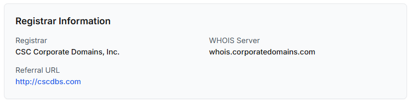
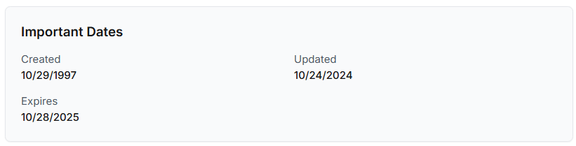
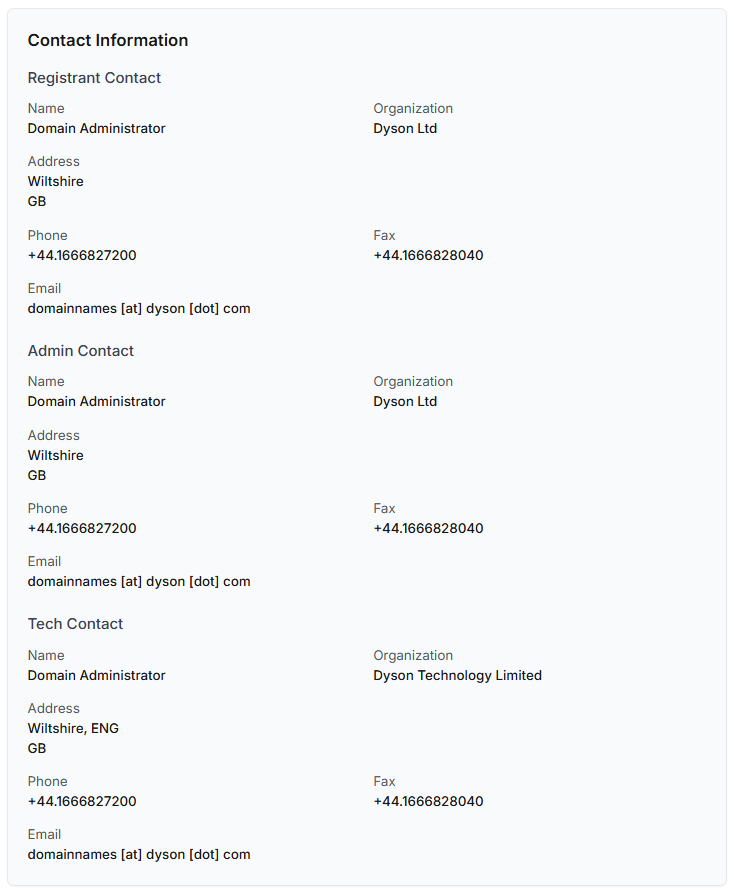
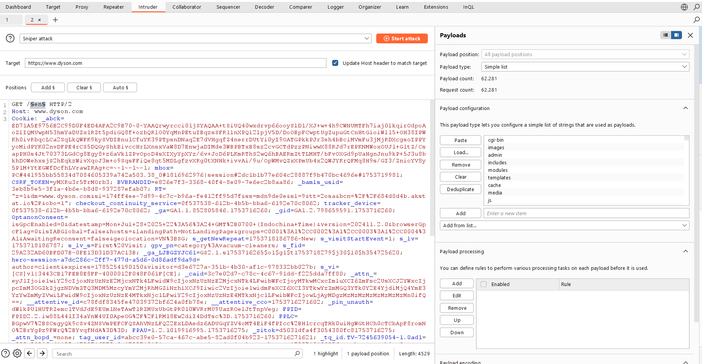
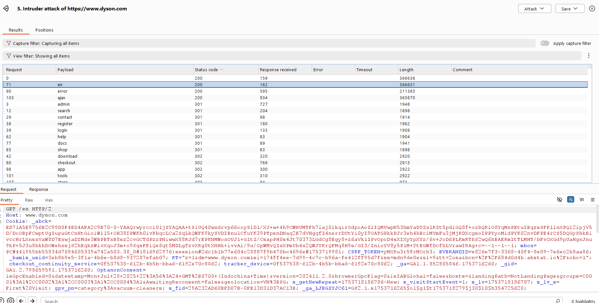
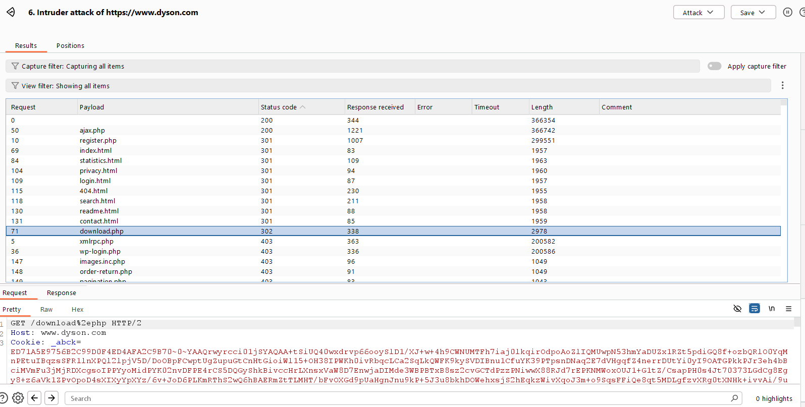
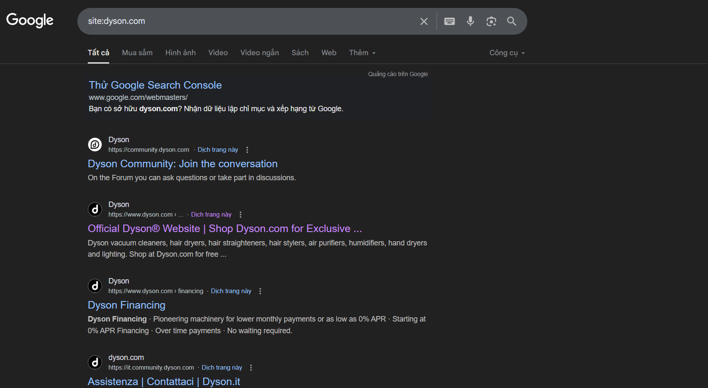
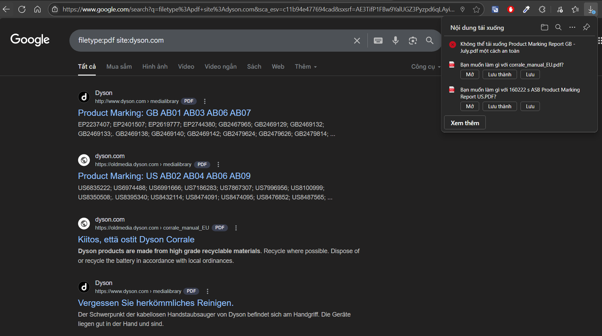
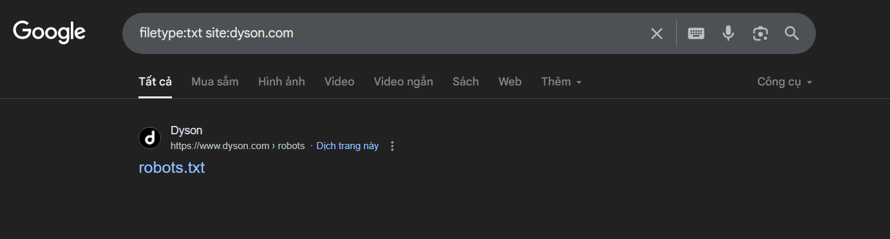

# Information Gathering
> Mục tiêu: dyson.com
> 
> Thực hiện: Trần Tiến Đức
> 
> Cập nhật lần cuối: 02/07/2025

# Mục lục
- [Information Gathering](#information-gathering)
- [Gathering Information Using Whois Lookup](#gathering-information-using-whois-lookup)
- [Discovering Websites On The Same Server](#discovering-websites-on-the-same-server)
- [Discovering Subdomains](#discovering-subdomains)
- [Discovering Sensitive Files](#discovering-sensitive-files)
- [Google Hacking](#google-hacking)

# Scope Based Recon
Phương pháp `Scope Based Recon` chia quy trình recon dựa trên phạm vi, giúp tiết kiệm thời gian, biết chính xác những gì cần tìm kiếm, dễ dàng tự động hóa quy trình.

Dựa vào phương pháp này, ta sẽ chia thành 3 phạm vi:
- Small Based Recon
- Medium Based Recon
- Large Based Recon

Ta sẽ đi vào lần lượt từng scope đối với mục tiêu là `dyson.com`

# Small Based Recon
## Technology Fingerprinting
`Technology Fingerprinting` là kỹ thuật xác định công nghệ mà một website hoặc ứng dụng web đang sử dụng, như: CMS, framework, server, ngôn ngữ lập trình, thư viện JS, font,...

Ở đây ta sẽ sử dụng **`Wappalyzer`**


Thu về được khá nhiều thông tin về công nghệ mà `dyson` đang sử dụng, có thể tóm tắt nó như sau:

|Technology Category			|Detected Technology
|---------------------------------------|------------------------
| Ecommerce | Cart Functionality, Amazon Webstore
| CMS | Adobe Experience Manager
| Webmail | Microsoft 365, Apple iCloud Mail
| Programming languages | Java, PHP
| UI Frameworks | Bootstrap
| Web servers | Apache HTTP Server, Microsoft HTTPAPI (2.0)
| Payment proccessors | Affirm (2), Afterpay (1.32.11)
| PaaS | Amazon Web Services
| JavaScript Frameworks | Handlebars
| Security | HSTS, Akamai Bot Manager, Riskified
| SSL/TLS certificate authorities | DigiCert
| RUM | New Relic, Akamai mPulse, Boomerang
| Performance | Queue-it (2.0.52), Priority Hints, Lozad.js
| JavaScript libraries | jQuery (3.6.0), core-js (2.6.12), Lozad.js, Boomerang, Slick (1.9.0)
| Cookie compliance | OneTrust
| CDN | Akamai, jsDelivr, Amazon S3, Cloudflare, cdnjs, jQuery CDN
| ... | ...

## Directory Enumeration
`Directory Enumeration` là kỹ thuật dùng để tìm ra các directory hoặc file ẩn trên website hoặc máy chủ

Có khá nhiều tool giúp chúng ta chuyện này nhưng trong bài này ta sẽ chỉ tập trung vào sử dụng là **`ffuf`** và **`dirsearch`**

Dựa vào thông tin về công nghệ mà `dyson` sử dụng mà ta đã thu thập ở trước, ta biết được rằng website sử dụng `Akamai` đây là hệ thống phát hiện chặn bot. Nếu sử dụng **`ffuf`** cũng như **`dirsearch`** mà không giả lập giống như một browser kỹ càng thì rất dễ bị `403 Forbidden`

Để làm được như vậy, ta cần cũng cấp cho nó những header giống với browser khi gửi request. Đầu tiên bắt request bằng **`burp suite`**, sau đó lấy header bỏ vào tool chạy


Đối với **`ffuf`**, ta dùng `-H` để đính kèm header khi chạy, dùng thêm `-rate` để giới hạn tốc độ gửi, tránh bị chặn khi gửi quá nhiều req/s


Đối với **`dirsearch`** có option `--headers-file` sẽ tiện hơn trong việc thay đổi header, cũng như gặp các status code 30x cũng sẽ hiện rõ là sẽ redirect tới đâu, khá là tiện


## Port Scanning
`Port Scanning` là kỹ thuật để phát hiện port nào đang mở ở trên website hoặc máy chủ

Ở đây ta sẽ dùng **`rustscan`** mang lại hiệu suất nhanh hơn **`nmap`**
```bash
┌──(trntd㉿kali)-[~/Documents/tools/dirsearch]
└─$ rustscan -a dyson.com                         
.----. .-. .-. .----..---.  .----. .---.   .--.  .-. .-.
| {}  }| { } |{ {__ {_   _}{ {__  /  ___} / {} \ |  `| |
| .-. \| {_} |.-._} } | |  .-._} }\     }/  /\  \| |\  |
`-' `-'`-----'`----'  `-'  `----'  `---' `-'  `-'`-' `-'
The Modern Day Port Scanner.
________________________________________
: http://discord.skerritt.blog         :
: https://github.com/RustScan/RustScan :
 --------------------------------------
RustScan: allowing you to send UDP packets into the void 1200x faster than NMAP

[~] The config file is expected to be at "/home/trntd/.rustscan.toml"
[!] File limit is lower than default batch size. Consider upping with --ulimit. May cause harm to sensitive servers
[!] Your file limit is very small, which negatively impacts RustScan's speed. Use the Docker image, or up the Ulimit with '--ulimit 5000'. 
Open 52.59.122.122:80
Open 52.59.122.122:443
[~] Starting Script(s)
[~] Starting Nmap 7.95 ( https://nmap.org ) at 2025-08-02 05:54 EDT
Initiating Ping Scan at 05:54
Scanning 52.59.122.122 [4 ports]
Completed Ping Scan at 05:54, 0.02s elapsed (1 total hosts)
Initiating Parallel DNS resolution of 1 host. at 05:54
Completed Parallel DNS resolution of 1 host. at 05:54, 0.04s elapsed
DNS resolution of 1 IPs took 0.04s. Mode: Async [#: 2, OK: 1, NX: 0, DR: 0, SF: 0, TR: 1, CN: 0]
Initiating SYN Stealth Scan at 05:54
Scanning ec2-52-59-122-122.eu-central-1.compute.amazonaws.com (52.59.122.122) [2 ports]
Discovered open port 443/tcp on 52.59.122.122
Discovered open port 80/tcp on 52.59.122.122
Completed SYN Stealth Scan at 05:54, 0.23s elapsed (2 total ports)
Nmap scan report for ec2-52-59-122-122.eu-central-1.compute.amazonaws.com (52.59.122.122)
Host is up, received reset ttl 255 (0.050s latency).
Scanned at 2025-08-02 05:54:19 EDT for 0s

PORT    STATE SERVICE REASON
80/tcp  open  http    syn-ack ttl 64
443/tcp open  https   syn-ack ttl 64

Read data files from: /usr/share/nmap
Nmap done: 1 IP address (1 host up) scanned in 0.42 seconds
           Raw packets sent: 6 (240B) | Rcvd: 4 (172B)
```
Nó chỉ mở 2 port cho `HTTP` và `HTTPS`, cũng không bất ngờ lắm, nó mà mở port khác như 22 là tới công chuyện liền 🤣

## JS Recon
...


## Google Dorking & GitHub Dorking
`Google Dorking` và `GitHub Dorking` đều là kỹ thuật truy vấn nâng cao giúp tìm kiếm thông tin nhạy cảm hoặc hữu ích từ các nguồn công khai (Google hoặc GitHub)

Về `Goole Dorking`, ta có thể sử dụng **`Fast-Google-Dorks-Scan`**


Còn về `GitHub Dorking` ta có thể sử dụng **`GitDorker`**

`python GitDorker.py -tf github_API.txt -q dyson.com -d Dorks/medium_dorks.txt -o dyson`

Sau khi chạy xong nó sẽ lưu kết quả vào file CSV


# Medium Based Recon
## Subdomain Enumeration
Ở đây ta sẽ sử dụng 2 tool là **`assetfinder`** và **`subfinder`**

`assetfinder --subs-only dyson.com > sub_assetfinder.txt`

`subfinder -d dyson.com -v > sub_finder.txt`

Dùng **`wc`** thì biết được rằng **`assetfinder`** cho về nhiều kết quả hơn


Tiếp theo ta sẽ dùng **`httpx`** để xác định xem subdomain nào đang hoạt động dựa trên status code
`cat sub_assetfinder.txt | httpx -fc 404 -title -wc -sc -ct -cl -web-server -asn -location > sub2_assetfinder.txt`

Có hơn 600 kết quả trả về


## Template Based Scanning
**`Template Based Scanning`** là kỹ thuật dùng để kiểm tra các lỗ hổng bảo mật, cấu hình sai,... bằng cách sử dụng các file tempalte định nghĩa sẵn. Ở đây ta sẽ sử dụng **`nuclei`**
```bash
┌──(trntd㉿kali)-[~/nuclei-templates/code]
└─$ nuclei -target https://www.dyson.com

                     __     _
   ____  __  _______/ /__  (_)
  / __ \/ / / / ___/ / _ \/ /
 / / / / /_/ / /__/ /  __/ /
/_/ /_/\__,_/\___/_/\___/_/   v3.4.7

                projectdiscovery.io

[INF] Current nuclei version: v3.4.7 (latest)
[INF] Current nuclei-templates version: v10.2.6 (latest)
[WRN] Scan results upload to cloud is disabled.
[INF] New templates added in latest release: 41
[INF] Templates loaded for current scan: 8237
[INF] Executing 8036 signed templates from projectdiscovery/nuclei-templates
[WRN] Loading 201 unsigned templates for scan. Use with caution.
[INF] Targets loaded for current scan: 1
[INF] Templates clustered: 1770 (Reduced 1664 Requests)
[INF] Using Interactsh Server: oast.fun
[waf-detect:akamai] [http] [info] https://www.dyson.com
[tls-version] [ssl] [info] www.dyson.com:443 ["tls12"]
[tls-version] [ssl] [info] www.dyson.com:443 ["tls13"]
[http-missing-security-headers:permissions-policy] [http] [info] https://www.dyson.com
[http-missing-security-headers:x-frame-options] [http] [info] https://www.dyson.com
[http-missing-security-headers:x-content-type-options] [http] [info] https://www.dyson.com
[http-missing-security-headers:x-permitted-cross-domain-policies] [http] [info] https://www.dyson.com
[http-missing-security-headers:referrer-policy] [http] [info] https://www.dyson.com
[http-missing-security-headers:clear-site-data] [http] [info] https://www.dyson.com
[http-missing-security-headers:cross-origin-embedder-policy] [http] [info] https://www.dyson.com
[http-missing-security-headers:cross-origin-opener-policy] [http] [info] https://www.dyson.com
[http-missing-security-headers:cross-origin-resource-policy] [http] [info] https://www.dyson.com
[http-missing-security-headers:strict-transport-security] [http] [info] https://www.dyson.com
[http-missing-security-headers:content-security-policy] [http] [info] https://www.dyson.com
[tech-detect:akamai] [http] [info] https://www.dyson.com
[caa-fingerprint] [dns] [info] www.dyson.com
[dns-saas-service-detection:akamai-cdn] [dns] [info] www.dyson.com ["dyson.com.edgekey.net"]
[ssl-issuer] [ssl] [info] www.dyson.com:443 ["DigiCert Inc"]
[ssl-dns-names] [ssl] [info] www.dyson.com:443 ["www.dysonindie.com","www.mimosatrust.com","stylingtour.dyson.at","www.dysonmalmesbury.co.uk","www.sa.dyson.com","forbusiness.dyson.com.sg","shop.dyson.cn","shop.dyson.co.th","shop.dyson.de","test-shop.dyson.com.au","www.dyson.cn","www.dyson.es","www.dyson.nl","www.dyson.com","oldmedia.dyson.com","reviews.dyson.com","www.dyson.dk","beta.dyson.com.au","shop.dyson.no","shop.dyson.tw","stage.dyson.com.au","www.dyson.ch","www.dyson.co.nz","www.dyson.my","service.dyson.com","support.dyson.pl","www.jamesanddeirdredysontrust.com","acpsirextsit.dyson.hk","pdev.dyson.hk","support.dyson.com.sg","www.dysonrecall.com","www.starandstormfoundation.com","acpsirextdev.dyson.hk","shop.dyson.at","shop.dyson.dk","shop.dyson.es","shop.dyson.hk","shop.dyson.pl","staging.dyson.co.nz","staging.shop.dyson.co.th","troubleshooting.dyson.com","www.dyson.ae","shop.fi.dyson.com","www.dyson.be","www.dyson.com.ee","www.dyson.com.sg","www.dyson.hk","www.dyson.lt","www.dyson.se","www.dysonbrandcentre.com","psit.dyson.hk","shop.dyson.ae","shop.dyson.my","staging.shop.dyson.my","tandcs.dyson.com","www.dyson.at","www.dyson.co.il","www.fi.dyson.com","forbusiness.dyson.pl","m2admin.dyson.com.au","media.dyson.com","shop.dyson.com.sg","shop.dyson.nl","www.dyson.com.au","www.dyson.com.kh","p.dyson.hk","shop.dyson.be","shop.dyson.co.il","support.dyson.com.au","upgrade.dyson.cn","www.dyson.co.jp","www.dyson.de","www.dyson.it","feedback.dyson.com","rework.dysonrecall.com","shop.dyson.co.nz","support.dyson.co.th","support.dyson.hk","www.bluesurftrust.com","www.careers.dyson.com","www.dyson.fr","admin.dyson.com.au","shop.dyson.ch","shop.dyson.com.au","shop.dyson.it","shop.dyson.se","stage.m2admin.dyson.com.au","www.dyson.co.th","www.dyson.ee","acpsirext.dyson.hk","shop.dyson.fr","www.dyson.ma","www.dysoncanada.ca"]                                          
[INF] Scan completed in 2m. 19 matches found.
```
Có thể thấy `dyson` thiếu nhiều cơ chế bảo mật cơ bản như `content-security-policy`, `strict-transport-security`, `x-content-type-options`, `referrer-policy`,...

# Large Scope Recon
## Gathering Information Using Whois Lookup

Ở đây ta sẽ sử dụng công cụ **`whois`** ở **who.is**





Ta sẽ thu thập được những thông tin cơ bản sau:
|Mục                    |Thông tin
|-----------------------|---------------------------
|Địa chỉ IP             |52.59.125.242
|Nhà đăng ký            |CSC Corporate Domains, Inc
|WHOIS Server           |whois.corporatedomains.com
|Ngày đăng ký           |29/10/1997
|Ngày cập nhật          |10/24/2024
|Ngày hết hạn           |10/28/2025
|Điện thoại             |+44.1666827200
|Fax                    |+44.1666828040
|Email                  |domainnames [at] dyson [dot] com


Thông tin liên hệ:
|Vai trò        |Tên liên hệ            |Tổ chức        |Quốc gia
|---------------|-----------------------|---------------|-------------
|Registrant     |Domain Administrator   |Dyson Ltd      |Wiltshire, GB
|Admin          |Domain Administrator   |Dyson Ltd      |Wiltshire, GB
|Tech           |Domain Administrator   |Dyson Ltd      |Wiltshire, GB


## Discovering Websites On The Same Server
Để tim được những website khác có cùng server (địa chỉ IP) ta sử dụng `Reverse IP lookup`.
`Reverse IP lookup` là quá trình dùng địa chỉ IP để tìm ra các tên miền (domain) được host trên cùng địa chỉ IP đó.

Ở viewdns.info có hỗ trợ chức năng Reverse IP lookup [tại đây](https://viewdns.info/reverseip/). Đây là danh sách Websites On The Same Server
|Websites               |
|-----------------------|
bluesurftrust.com	
buydysonairblade.uk	
dyson.bg	
dyson.cn	
dyson.co.jp	
dyson.co.kr	
dyson.co.th	
dyson.com	
dyson.com.ar	
dyson.com.cy	
dyson.com.jm	
dyson.com.kh	
dyson.com.pa	
dyson.com.ru	
dyson.cr	
dyson.do	
dyson.gt	
dyson.is	
dyson.lu	
dyson.ro	
dyson.si	
dysonbrandcentre.com	
dysoninstitute.co.uk	
dysonmalmesbury.co.uk	
dysonoffice.com	
dysonoutlet.co.uk	
...

## Discovering Subdomains
Subdomain là tên miền phụ của một website dùng để tạo ra các khu vực hoặc dịch vụ riêng biệt trên cùng một trang web
Ví dụ: một trang web có domain như sau: `example.com` thì subdomain của nó là `subdomain.example.com`

Ở đây ta sẽ dùng **`subfinder`** được viết bằng `Go` đem lại hiệu suất nhanh.
```bash
$ subfinder -d dyson.com -v

pandemicflu.api.cppref.dyson.com
api.cptest.dyson.com
www.depannage-ordinateur-windows-virus.161.dyson.com
www.vaccinetemperature.1ci1.dyson.com
vaccines.b1.dyson.com
covidapi.dyson.com
covideo.cfappapi.cppe.dyson.com
console.cpppe.dyson.com
awseg-au.dyson.com
iladmin.content.dyson.com
690.dyson.com
access-uk-motor.dyson.com
covideo.b200.dyson.com
vaccinetemperature.commvault-test.dyson.com
ppe.connected.dyson.com
go.cpnst-prd.dyson.com
deletev9redirectvirus.1ci1.dyson.com
voroncovka.20.dyson.com
antivirus-uk.dyson.com
livelab.dyson.com
brokerbridge.cpsi.dyson.com
kefalos-uncovered.broker19.cptrials.dyson.com
identity-hub.dyson.com
sa-content.commerce.dyson.com
...
```

Lưu toàn bộ subdomain vào file `sub.txt`. Ta sẽ dùng **`httpx`** để lọc ra những subdomain có thể truy cập được sau đó lưu vào `sub2.txt`

```bash
$ cat sub.txt |  httpx -fc 404 -title -wc -sc -ct -cl -web-server -asn -location > sub2.txt
$ cat sub2.txt

https://admin-content.commerce.dyson.com [401] [] [340] [text/html] [Error] [] [AS54113, FASTLY, US, 151.101.0.0/22] [83]
https://ae-content.commerce.dyson.com [301] [/en-AE/] [0] [] [] [] [AS54113, FASTLY, US, 151.101.0.0/22] [1]
http://admin.template.staging.dyson.com [301] [https://admin.template.staging.dyson.com/] [0] [] [] [AkamaiGHost] [AS45899, PT-AS- PT Corp, VN, 113.171.234.0/24] [1]
http://abcc.dyson.com [200] [] [49503] [text/html] [Cost Calculator] [Microsoft-IIS/7.5] [AS45899, PT-AS- PT Corp, VN, 113.171.234.0/24] [2388]
https://appapi.cp.dyson.com [200] [] [3] [application/json] [] [cloudflare] [2]
https://authoring.b2bapp.dyson.com [200] [] [274] [text/html] [HealthCheck] [Microsoft-IIS/7.5] [AS20940, AKAMAI-ASN1, NL, US, 23.200.143.0/24] [7]
https://beta.dyson.com [403] [] [368] [text/html] [Access Denied] [AkamaiGHost] [AS45899, PT-AS- PT Corp, VN, 113.171.234.0/24] [13]
https://central-test.dyson.com [200] [] [2169] [text/html] [Dyson Central - Test Environment] [Microsoft-IIS/10.0] [AS702, UUNET, US, GB, 62.189.0.0/16] [110]
https://central.dyson.com [200] [] [2150] [text/html] [Dyson Central] [Microsoft-IIS/10.0] [AS702, UUNET, US, GB, 62.189.0.0/16] [107]
https://chat-dev.dyson.com [200] [] [7033] [text/html] [chatDyson] [uvicorn] [AS20940, AKAMAI-ASN1, NL, US, 104.84.150.0/24] [340]
https://chat.dyson.com [200] [] [7030] [text/html] [chatDyson] [uvicorn] [AS20940, AKAMAI-ASN1, NL, US, 104.84.150.0/24] [340]
https://community.dyson.com [200] [] [52679] [text/html] [Join the conversation | Dyson Community] [nginx] [1656]
https://gtm.dyson.com [200] [] [35] [image/gif] [] [] [AS15169, GOOGLE, US, 216.239.32.0/24] [1]
https://go.cpnst-prd.dyson.com [204] [] [0] [application/json] [] [] [AS16509, AMAZON-02, US, 13.226.120.0/21] [1]
...
```

## Discovering Sensitive Files
Ta có thể dùng **`gobuster`**, **`dirsearch`**, **`ffuf`**,... để fuzz các folder cũng như các file nhạy cảm

```bash
┌──(trntd㉿kali)-[~/Documents/wordlists]
└─$ ffuf -u https://www.dyson.com/FUZZ -w /usr/share/wordlists/seclists/Discovery/Web-Content/raft-large-directories.txt -mc 200,401,403 

        /'___\  /'___\           /'___\       
       /\ \__/ /\ \__/  __  __  /\ \__/       
       \ \ ,__\\ \ ,__\/\ \/\ \ \ \ ,__\      
        \ \ \_/ \ \ \_/\ \ \_\ \ \ \ \_/      
         \ \_\   \ \_\  \ \____/  \ \_\       
          \/_/    \/_/   \/___/    \/_/       

       v2.1.0-dev
________________________________________________

 :: Method           : GET
 :: URL              : https://www.dyson.com/FUZZ
 :: Wordlist         : FUZZ: /usr/share/wordlists/seclists/Discovery/Web-Content/raft-large-directories.txt
 :: Follow redirects : false
 :: Calibration      : false
 :: Timeout          : 10
 :: Threads          : 40
 :: Matcher          : Response status: 200,401,403
________________________________________________

tmp                     [Status: 403, Size: 370, Words: 13, Lines: 11, Duration: 57ms]
register                [Status: 403, Size: 375, Words: 13, Lines: 11, Duration: 61ms]
node                    [Status: 403, Size: 371, Words: 13, Lines: 11, Duration: 67ms]
test                    [Status: 403, Size: 371, Words: 13, Lines: 11, Duration: 70ms]
modules                 [Status: 403, Size: 374, Words: 13, Lines: 11, Duration: 62ms]
libraries               [Status: 403, Size: 376, Words: 13, Lines: 11, Duration: 72ms]
forum                   [Status: 403, Size: 372, Words: 13, Lines: 11, Duration: 84ms]
templates               [Status: 403, Size: 376, Words: 13, Lines: 11, Duration: 94ms]
wp-includes             [Status: 403, Size: 382, Words: 13, Lines: 11, Duration: 70ms]
login                   [Status: 403, Size: 372, Words: 13, Lines: 11, Duration: 70ms]
add                     [Status: 403, Size: 370, Words: 13, Lines: 11, Duration: 71ms]
includes                [Status: 403, Size: 375, Words: 13, Lines: 11, Duration: 70ms]
css                     [Status: 403, Size: 370, Words: 13, Lines: 11, Duration: 79ms]
password                [Status: 403, Size: 375, Words: 13, Lines: 11, Duration: 73ms]
search                  [Status: 403, Size: 373, Words: 13, Lines: 11, Duration: 80ms]
profiles                [Status: 403, Size: 375, Words: 13, Lines: 11, Duration: 91ms]
admin                   [Status: 403, Size: 372, Words: 13, Lines: 11, Duration: 90ms]
scripts                 [Status: 403, Size: 374, Words: 13, Lines: 11, Duration: 82ms]
logout                  [Status: 403, Size: 373, Words: 13, Lines: 11, Duration: 95ms]
administrator           [Status: 403, Size: 380, Words: 13, Lines: 11, Duration: 74ms]
js                      [Status: 403, Size: 369, Words: 13, Lines: 11, Duration: 92ms]
misc                    [Status: 403, Size: 371, Words: 13, Lines: 11, Duration: 79ms]
bin                     [Status: 403, Size: 370, Words: 13, Lines: 11, Duration: 76ms]
plugins                 [Status: 403, Size: 374, Words: 13, Lines: 11, Duration: 84ms]
cache                   [Status: 403, Size: 372, Words: 13, Lines: 11, Duration: 107ms]
cgi-bin                 [Status: 403, Size: 378, Words: 13, Lines: 11, Duration: 104ms]
wp-content              [Status: 403, Size: 381, Words: 13, Lines: 11, Duration: 93ms]
reply                   [Status: 403, Size: 372, Words: 13, Lines: 11, Duration: 94ms]                   [Status: 403, Size: 371, Words: 13, Lines: 11, Duration: 
```

Kết quả trả về toàn 403, khả năng là do `dyson.com` có cơ chế chặn các tool fuzzing.
Ta thử thêm vài header để làm cho nó giống như một browser gửi request xem sao.

```bash
┌──(trntd㉿kali)-[~/Documents/wordlists]
└─$ ffuf -u https://www.dyson.com/FUZZ -w /usr/share/wordlists/seclists/Discovery/Web-Content/raft-large-directories.txt -mc 200,301,401,403 -H "User-Agent: Mozilla/5.0 (Windows NT 10.0; Win64; x64) AppleWebKit/537.36 (KHTML, like Gecko) Chrome/91.0.4472.124 Safari/537.36" -H "Accept: text/html,application/xhtml+xml,application/xml;q=0.9,image/webp,*/*;q=0.8" -H "Accept-Language: en-US,en;q=0.5"
```
Nó không còn trả về 403 nữa nhưng lại không in ra bất cứ kết quả nào, khả năng là những header vừa thêm vào là vẫn chưa đủ.
Có một tool có thể giúp tạo ra request giống với một browser nhất là **`burp suite`**. Ta sẽ sử dụng `Intruder` để fuzz thay cho các tool kia.




## Google Hacking
`Google Hacking` hay còn gọi là `Google Dorking` là kỹ thuật sử dụng các truy vấn tìm kiếm nâng cao (Google Dorks) trên công cụ tìm kiếm Google để tìm kiếm thông tin nhạy cảm hoặc các lỗ hổng bảo mật trên các trang web, máy chủ, hoặc hệ thống trực tuyến.

Đầu tiên ta có thể sử dụng **`site`** để giới hạn kết quả tìm kiếm trong một domain cụ thể. Ta cũng có thể dựa vào nó để tìm thêm các subdomain khác khi fuzz bằng wordlist có thể không ra.


Tiếp theo là **`filetype`**, ta có thể tìm kiếm các tệp có định dạng cụ thể như `txt`, `pdf`, `xsls`,...



Còn nhiều các toán tử tìm kiếm nâng cao khác, có thể tham khảo thêm [ở đây](https://www.imperva.com/learn/application-security/google-dorking-hacking/)


